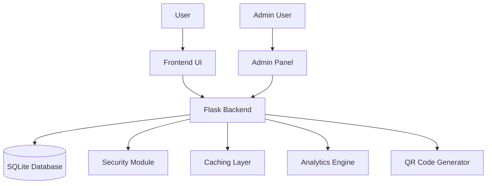

# URL Shortening Service - Technical Specification

## Technology Stack
- **Frontend**: HTML/CSS/JavaScript (Vanilla)
- **Backend**: Python/Flask
- **Database**: SQLite
- **QR Code Generation**: Python qr libraries
- **Caching**: In-memory caching with Flask-Caching

## Project Structure
```
link_shortner/
├── app.py                 # Main Flask application
├── models.py             # Database models
├── database.py           # Database initialization and connection
├── utils.py              # Utility functions (URL generation, validation, etc.)
├── security.py           # Security functions (spam detection, malicious URL filtering)
├── config.py             # Application configuration
├── requirements.txt      # Python dependencies
├── static/               # Static files (CSS, JavaScript, images)
│   ├── css/
│   │   ├── style.css
│   │   └── responsive.css
│   └── js/
│       ├── main.js
│       ├── analytics.js
│       └── admin.js
└── templates/            # HTML templates
    ├── index.html
    ├── admin.html
    ├── dashboard.html
    └── preview.html
```

## Database Schema Design

### URLs Table
```sql
CREATE TABLE urls (
    id INTEGER PRIMARY KEY AUTOINCREMENT,
    original_url TEXT NOT NULL,
    short_code TEXT UNIQUE NOT NULL,
    created_at TIMESTAMP DEFAULT CURRENT_TIMESTAMP,
    expires_at TIMESTAMP,
    clicks INTEGER DEFAULT 0,
    is_active BOOLEAN DEFAULT TRUE,
    user_id INTEGER,
    FOREIGN KEY(user_id) REFERENCES users(id)
);
```

### Users Table
```sql
CREATE TABLE users (
    id INTEGER PRIMARY KEY AUTOINCREMENT,
    username TEXT UNIQUE NOT NULL,
    password_hash TEXT NOT NULL,
    email TEXT UNIQUE,
    created_at TIMESTAMP DEFAULT CURRENT_TIMESTAMP,
    is_admin BOOLEAN DEFAULT FALSE
);
```

### Analytics Table
```sql
CREATE TABLE analytics (
    id INTEGER PRIMARY KEY AUTOINCREMENT,
    url_id INTEGER NOT NULL,
    ip_address TEXT,
    user_agent TEXT,
    referer TEXT,
    timestamp TIMESTAMP DEFAULT CURRENT_TIMESTAMP,
    country TEXT,
    city TEXT,
    FOREIGN KEY(url_id) REFERENCES urls(id)
);
```

## API Endpoints

### Public Endpoints
1. `POST /shorten` - Create a new short URL
2. `GET /<short_code>` - Redirect to original URL
3. `GET /preview/<short_code>` - Preview original URL

### Admin Endpoints
1. `GET /admin` - Admin panel login
2. `POST /admin/login` - Authenticate admin user
3. `GET /admin/dashboard` - Analytics dashboard
4. `GET /admin/urls` - View all URLs
5. `POST /admin/urls/<id>/toggle` - Enable/disable URL
6. `POST /admin/urls/<id>/delete` - Delete URL
7. `GET /admin/users` - Manage users

## System Architecture



## Component Specifications

### URL Shortening Algorithm
- Use Base62 encoding (0-9, a-z, A-Z) for short codes
- Default short code length: 6 characters
- Custom URL support with validation

### Security Features
- Spam detection using rate limiting
- Malicious URL filtering using VirusTotal API or similar
- Input validation and sanitization
- XSS prevention in templates

### Analytics Features
- Click tracking with timestamps
- Geolocation data using IP geolocation service
- Referer tracking
- User agent parsing
- Chart visualization using Chart.js

### QR Code Generation
- Generate QR codes for each shortened URL
- Serve QR codes as PNG images
- API endpoint to retrieve QR code

### Caching Mechanism
- Cache frequently accessed URLs in memory
- Invalidate cache when URL is updated/deleted
- Set cache expiration times

## Responsive Design Requirements
- Mobile-first approach
- Breakpoints:
  - Mobile: < 768px
  - Tablet: 768px - 1024px
  - Desktop: > 1024px
- Touch-friendly interface
- Adaptive layouts for all components

## UI/UX Features

### Homepage
- Clean, modern interface
- URL input form with customization options
- Short URL display with copy button
- QR code preview
- Social sharing buttons

### Admin Panel
- User authentication
- URL management table
- User management interface
- Analytics dashboard with charts
- Settings panel

### Dashboard
- Real-time click statistics
- Geographic distribution map
- Trending URLs
- User activity logs

## Implementation Plan
This will be implemented in phases:
1. Backend core functionality (URL shortening, redirection)
2. Database integration
3. Basic frontend UI
4. Admin panel
5. Analytics dashboard
6. Security features
7. QR code generation
8. Responsive design
9. Performance optimization
10. Final testing and deployment